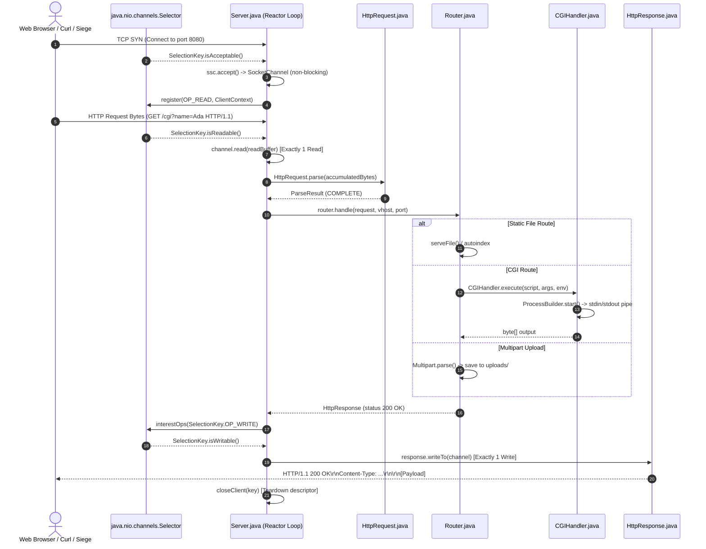

# LocalServer 2.0 — Deep Dive Technical Guide & Architecture Reference

An exhaustive, end-to-end technical reference manual covering every concept, networking principle, Java NIO API, class, method, data structure, and import in **LocalServer 2.0**.

---

## 1. Executive Summary & Architecture

LocalServer 2.0 is a production-grade, crash-proof, single-threaded HTTP/1.1 web server built strictly using core Java (`java.nio`, `java.net`, `java.io`). It requires zero external dependencies and achieves high throughput via non-blocking I/O multiplexing.

### 1.1 Architecture Comparison: Thread-per-Client vs. Non-Blocking Reactor

```
Traditional Thread-per-Connection:
[Client 1] ───> [Thread 1 (Blocked on read)] ───> Memory: ~1MB Stack per thread
[Client 2] ───> [Thread 2 (Blocked on read)] ───> High Context Switching Overhead
[Client N] ───> [Thread N (Blocked on read)] ───> OS Thread Exhaustion at scale

LocalServer 2.0 Single-Threaded Reactor:
[Client 1] ──┐
[Client 2] ──┼──> [ Single Selector (epoll / kqueue) ] ──> [ 1 Worker Thread ] ──> Event Dispatch
[Client N] ──┘         Non-Blocking Sockets                Zero Thread Overhead
```

### 1.2 Master Execution Flow



---

## 2. Core Theoretical Concepts Deep Dive

### 2.1 HTTP/1.1 Protocol Mechanics (RFC 9112 & RFC 7230)

HTTP/1.1 is an application-level, text-and-binary protocol transmitted over a TCP stream.

#### The Wire Format
An HTTP request consists of three distinct segments separated by Carriage Return Line Feed pairs (`CRLF = "\r\n"`):

```http
POST /files/ HTTP/1.1\r\n
Host: 127.0.0.1:8080\r\n
User-Agent: curl/7.88.1\r\n
Content-Type: text/plain\r\n
Content-Length: 13\r\n
Connection: close\r\n
\r\n
Hello, World!
```

1. **Request Line**:
   - `Method`: Identifies the operation (`GET`, `POST`, `DELETE`).
   - `Request-Target`: The URI or path including query parameters (`/files/?page=1`).
   - `HTTP-Version`: Strictly `HTTP/1.1`.
2. **Headers**: Key-value metadata pairs ending in `: `. Header names are case-insensitive. Terminated by an empty line (`\r\n\r\n`).
3. **Body**: The raw payload bytes.

#### Response Wire Format
```http
HTTP/1.1 200 OK\r\n
Server: LocalServer/2.0 (Java NIO)\r\n
Content-Type: text/plain; charset=utf-8\r\n
Content-Length: 13\r\n
Set-Cookie: session_id=c85e4...; Max-Age=3600; Path=/; HttpOnly; SameSite=Lax\r\n
Connection: close\r\n
\r\n
Hello, World!
```

---

### 2.2 I/O Multiplexing & The Reactor Pattern

#### How OS Sockets Work Under the Hood
In Linux, every network connection is represented as a file descriptor (FD). 
- In **blocking mode**, calling `read(fd)` halts thread execution until network packets arrive at the network interface card (NIC) and are copied into the kernel socket buffer.
- In **non-blocking mode** (`O_NONBLOCK`), calling `read(fd)` returns immediately with `EAGAIN` or `EWOULDBLOCK` if no data is available.

#### The Role of `Selector.select()`
Instead of constantly polling thousands of non-blocking descriptors in a busy-loop (which would consume 100% CPU), the kernel provides event notifications:
- **Linux**: `epoll_wait()`
- **BSD / macOS**: `kqueue()`
- **Windows**: `IOCP` / `WSAPoll`

`java.nio.channels.Selector` wraps these OS primitives. `selector.select(250)` puts the thread into kernel sleep until at least one registered channel has an I/O event or 250 milliseconds elapse.

---

### 2.3 Message Framing: Content-Length vs. Chunked Transfer Encoding

An HTTP parser must unambiguously determine where the request body ends to avoid hanging or request smuggling vulnerabilities.

#### Mode 1: Fixed Content-Length
```
[Headers: Content-Length: 10]\r\n\r\n[0123456789] -> Exactly 10 bytes consumed.
```

#### Mode 2: Transfer-Encoding: chunked
Used when the client or server streams dynamically generated content of unknown total size. The body is divided into a series of chunks formatted as:
```
<Hex Chunk Size>\r\n
<Raw Data>\r\n
```
Terminated by a chunk size of `0`:
```
0\r\n
\r\n
```

#### Concrete Chunked Stream Example
```http
POST /cgi HTTP/1.1\r\n
Host: 127.0.0.1:8080\r\n
Transfer-Encoding: chunked\r\n
\r\n
5\r\n
Hello\r\n
6\r\n
 World\r\n
0\r\n
\r\n
```
The server reads:
1. Hex `5` -> reads 5 bytes: `"Hello"`, verifies trailing `\r\n`.
2. Hex `6` -> reads 6 bytes: `" World"`, verifies trailing `\r\n`.
3. Hex `0` -> final chunk, verifies trailing `\r\n\r\n`.
4. Reassembles body to: `"Hello World"`.

---

### 2.4 Common Gateway Interface (CGI) Engine

The CGI specification (RFC 3875) allows the web server to execute external programs via child processes.

```
+---------------+           Fork / Exec            +-----------------------+
|               | -------------------------------> | ProcessBuilder        |
|               |                                  | (python3 / java / sh) |
|  LocalServer  | === Pipes Body via stdin =======>| Standard Input (stdin)|
|               |                                  |                       |
|               | <=== Captures stdout ============| Standard Output (out) |
+---------------+                                  +-----------------------+
```

#### Environment Variable Contract
The server passes request context via OS process environment variables:
- `GATEWAY_INTERFACE`: `"CGI/1.1"`
- `REQUEST_METHOD`: `"GET"`, `"POST"`, `"DELETE"`
- `PATH_INFO`: Virtual path of the URL (e.g. `"/cgi"`)
- `QUERY_STRING`: Raw URL query parameters (e.g. `"name=Ada&id=42"`)
- `CONTENT_LENGTH` & `CONTENT_TYPE`: Body metadata for POST requests
- `SERVER_NAME` & `SERVER_PORT`: Host listener information
- `HTTP_*`: Transformed client request headers (e.g. `User-Agent` becomes `HTTP_USER_AGENT`)

---

### 2.5 Multipart/Form-Data Parsing (RFC 7578)

Multipart form data transmits binary files and key-value fields in a single HTTP body:

```http
POST /files/ HTTP/1.1\r\n
Host: 127.0.0.1:8080\r\n
Content-Type: multipart/form-data; boundary=---------------------------123456\r\n
Content-Length: 285\r\n
\r\n
-----------------------------123456\r\n
Content-Disposition: form-data; name="note"\r\n
\r\n
audit-test\r\n
-----------------------------123456\r\n
Content-Disposition: form-data; name="file"; filename="hello.txt"\r\n
Content-Type: text/plain\r\n
\r\n
File content line 1\nFile content line 2\r\n
-----------------------------123456--\r\n
```

#### Parsing Steps:
1. Extract the boundary delimiter from `Content-Type`: `---------------------------123456`.
2. Locate the boundary marker `--` + `boundary` in the byte buffer.
3. For each part, parse part headers up to `\r\n\r\n`.
4. Extract the `name` and `filename` parameters from `Content-Disposition`.
5. Slice binary content between `\r\n\r\n` and the next `\r\n--` + `boundary`.
6. Terminate when the closing marker `--` + `boundary` + `--` is encountered.

---

### 2.6 HTTP State Management (RFC 6265)

Because HTTP is a stateless protocol, sessions track client state across multiple requests.

```
Client                                     Server
  |                                          |
  | 1. GET /                                 |
  | ---------------------------------------> | (No Cookie present)
  |                                          | Generates UUID: 4f1a8b...
  | 2. HTTP 200 OK                           | Stores session with TTL = now + 3600s
  |    Set-Cookie: session_id=4f1a8b...      |
  | <--------------------------------------- |
  |                                          |
  | 3. GET /files/                           |
  |    Cookie: session_id=4f1a8b...          | (Valid session found in cache)
  | ---------------------------------------> | Refreshes TTL: now + 3600s
  | 4. HTTP 200 OK (No Set-Cookie needed)    |
  | <--------------------------------------- |
```

---

## 3. Exhaustive Java Imports Reference

This section details every single import statement used in the codebase:

---

### `java.nio.ByteBuffer`
- **Used In**: [`Server.java`](file:///home/mosdef/localhost/src/Server.java), [`HttpResponse.java`](file:///home/mosdef/localhost/src/HttpResponse.java)
- **Role**: A contiguous block of linear byte memory managed by Java NIO.
- **Key Methods**:
  - `ByteBuffer.allocate(32 * 1024)`: Allocates a 32 KB heap buffer.
  - `buffer.clear()`: Resets `position = 0` and `limit = capacity` preparing the buffer for writing from the socket.
  - `buffer.flip()`: Sets `limit = position` and `position = 0` preparing the buffer for reading data into application logic.
  - `buffer.hasRemaining()`: Returns `true` if `position < limit`.
- **Implementation in Code**:
  ```java
  // In Server.java (Reading from socket)
  readBuffer.clear();
  int bytesRead = client.read(readBuffer);
  readBuffer.flip();
  ```

---

### `java.nio.channels.Selector`
- **Used In**: [`Server.java`](file:///home/mosdef/localhost/src/Server.java)
- **Role**: The central I/O event multiplexer managing selectable channels.
- **Key Methods**:
  - `Selector.open()`: Creates a new OS-level selector (e.g. `epoll_create`).
  - `selector.select(250)`: Waits for registered I/O events with a 250ms timeout.
  - `selector.selectedKeys()`: Returns the set of keys whose channels are ready for I/O.
  - `selector.wakeup()`: Unblocks a sleeping `select()` call during shutdown.
  - `selector.close()`: Destroys the selector and releases OS file descriptors.
- **Implementation in Code**:
  ```java
  // Master reactor loop in Server.java
  int ready = selector.select(250);
  if (ready > 0) {
      Iterator<SelectionKey> it = selector.selectedKeys().iterator();
      while (it.hasNext()) {
          SelectionKey key = it.next();
          it.remove(); // Must remove to avoid duplicate processing!
          if (!key.isValid()) continue;
          dispatch(key);
      }
  }
  ```

---

### `java.nio.channels.SelectionKey`
- **Used In**: [`Server.java`](file:///home/mosdef/localhost/src/Server.java)
- **Role**: Token representing the registration of a `SelectableChannel` with a `Selector`.
- **Key Methods**:
  - `key.isAcceptable()`: Tests whether channel is ready to accept a new socket connection (`OP_ACCEPT`).
  - `key.isReadable()`: Tests whether socket channel has data available to read (`OP_READ`).
  - `key.isWritable()`: Tests whether socket channel is ready for writing (`OP_WRITE`).
  - `key.interestOps(int ops)`: Mutates the event bitmask to change readiness interest.
  - `key.attachment()`: Retrieves the state object associated with the connection.
  - `key.cancel()`: Unregisters channel from selector.
- **Implementation in Code**:
  ```java
  // Switching interest from READ to WRITE in Server.java
  key.interestOps(SelectionKey.OP_WRITE);
  ```

---

### `java.nio.channels.ServerSocketChannel`
- **Used In**: [`Server.java`](file:///home/mosdef/localhost/src/Server.java)
- **Role**: Non-blocking listening socket for incoming TCP connections.
- **Key Methods**:
  - `ServerSocketChannel.open()`: Opens an unbound server channel.
  - `ssc.configureBlocking(false)`: Enables non-blocking operation.
  - `ssc.bind(InetSocketAddress, backlog)`: Binds to IP and port with a connection listen backlog queue (1024).
  - `ssc.accept()`: Non-blocking accept returning a `SocketChannel` or `null`.
- **Implementation in Code**:
  ```java
  ServerSocketChannel ssc = ServerSocketChannel.open();
  ssc.configureBlocking(false);
  ssc.setOption(StandardSocketOptions.SO_REUSEADDR, true);
  ssc.bind(addr, 1024);
  ssc.register(selector, SelectionKey.OP_ACCEPT, listenerContext);
  ```

---

### `java.nio.channels.SocketChannel`
- **Used In**: [`Server.java`](file:///home/mosdef/localhost/src/Server.java), [`HttpResponse.java`](file:///home/mosdef/localhost/src/HttpResponse.java)
- **Role**: Non-blocking TCP client stream connection.
- **Key Methods**:
  - `client.read(ByteBuffer dst)`: Reads non-blocking bytes into buffer. Returns bytes read, `0` if empty, or `-1` on EOF.
  - `client.write(ByteBuffer src)`: Writes non-blocking bytes from buffer to socket send buffer.
  - `client.close()`: Closes socket connection and sends TCP `FIN`.
- **Implementation in Code**:
  ```java
  int written = channel.write(outBuffer);
  if (written < 0) throw new IOException("Socket closed during write");
  ```

---

### `java.nio.file.Path` & `java.nio.file.Files`
- **Used In**: [`Main.java`](file:///home/mosdef/localhost/src/Main.java), [`Server.java`](file:///home/mosdef/localhost/src/Server.java), [`Router.java`](file:///home/mosdef/localhost/src/Router.java), [`ConfigLoader.java`](file:///home/mosdef/localhost/src/ConfigLoader.java), [`ErrorPages.java`](file:///home/mosdef/localhost/src/ErrorPages.java), [`CGIHandler.java`](file:///home/mosdef/localhost/src/CGIHandler.java)
- **Role**: Java NIO.2 file system API offering path operations and file manipulation.
- **Key Methods**:
  - `Path.of("config.json")`: Resolves string path.
  - `path.toRealPath()`: Resolves symbolic links and canonicalizes absolute path.
  - `path.normalize()`: Removes redundant `.` and `..` segments.
  - `path.startsWith(root)`: Verifies path containment to prevent path traversal exploits (`../../etc/passwd`).
  - `Files.readAllBytes(path)`: Fast whole-file binary reading.
  - `Files.write(path, bytes, options)`: Atomic file creation and writing.
  - `Files.delete(path)`: Removes file from disk for HTTP `DELETE`.
  - `Files.list(directory)`: Streams child files for directory listing.
- **Implementation in Code**:
  ```java
  // Path traversal check in Router.java
  Path routeRoot = config.rootDir().resolve(route.root()).normalize();
  Path candidate = routeRoot.resolve(sub).normalize();
  if (!candidate.startsWith(config.rootDir()) || !candidate.startsWith(routeRoot)) {
      return null; // Forbidden traversal blocked!
  }
  ```

---

### `java.net.StandardSocketOptions`
- **Used In**: [`Server.java`](file:///home/mosdef/localhost/src/Server.java)
- **Role**: Socket-level configuration options.
  - `SO_REUSEADDR`: Allows immediate binding to the same port even if sockets are lingering in `TIME_WAIT` state.
  - `TCP_NODELAY`: Disables Nagle's algorithm (packet buffering), transmitting small HTTP response headers immediately to achieve sub-3ms latencies.

---

### `java.util.concurrent.atomic.AtomicLong`
- **Used In**: [`Router.java`](file:///home/mosdef/localhost/src/Router.java)
- **Role**: Lock-free, hardware-level CPU compare-and-swap (CAS) primitive for atomic integer increments.
- **Use Case**: Real-time metrics counters (`totalRequests`, `count2xx`, `count3xx`, `count4xx`, `count5xx`) updated on every request without mutex lock contention.

---

### `java.util.concurrent.ConcurrentHashMap`
- **Used In**: [`utils/Session.java`](file:///home/mosdef/localhost/src/utils/Session.java)
- **Role**: Thread-safe hash table with lock striping.
- **Use Case**: Manages active sessions and their expiration timestamps safely without synchronizing entire read operations.

---

## 4. Class-by-Class & Function-by-Function Breakdown

---

### 4.1 `Main.java`

#### Class Purpose
The command-line entry point responsible for argument parsing, server configuration loading, lifecycle coordination, and clean shutdown handling.

```java
public final class Main
```

#### Methods

```java
public static void main(String[] args)
```
- **Use Case**: Main process execution.
- **Step-by-Step Logic**:
  1. Calls `parseConfigPath(args)` to resolve the configuration JSON path.
  2. Invokes `ConfigLoader.load(configPath)` to parse and validate settings.
  3. Instantiates `Server(config)`.
  4. Registers a JVM shutdown hook (`Runtime.getRuntime().addShutdownHook`) to execute `server.close()` when SIGINT/SIGTERM is received.
  5. Calls `server.run()` to start the non-blocking reactor loop.
  6. Catches `IllegalArgumentException` (prints error and exits with code 2) and general `Exception` (exits with code 1).
- **Example Usage**:
  ```bash
  java -jar build/java-server.jar --config config.json
  ```

```java
private static Path parseConfigPath(String[] args)
```
- **Use Case**: CLI argument parser.
- **Step-by-Step Logic**:
  1. If `args` is empty, defaults to `Path.of("config.json")`.
  2. If `args[0]` is `"--help"` or `"-h"`, prints usage and exits cleanly.
  3. If `args[0]` starts with `"--config="`, extracts substring from index 9.
  4. If `args` is 2 elements with `"--config"` or `"-c"`, returns `Path.of(args[1])`.
  5. Otherwise, displays help text and exits.

---

### 4.2 `Server.java`

#### Class Purpose
The single-threaded non-blocking reactor multiplexing all server sockets and client connections.

```java
public final class Server implements Runnable, Closeable
```

#### Fields & Context Records
- `config`: Active `ServerConfig` instance.
- `router`: Request routing engine.
- `selector`: Single `java.nio.channels.Selector` instance.
- `serverChannels`: List of listening `ServerSocketChannel` instances.
- `readBuffer`: Reusable direct `ByteBuffer` of size 32 KB.
- `running`: Volatile boolean controlling the reactor loop.
- **`record ListenerContext(List<VirtualServer> vhosts, int port)`**: Attached to listening socket selection keys to carry virtual host configurations.
- **`class ClientContext`**: Attached to client socket selection keys. Stores:
  - `vhosts`: Associated virtual hosts for this port.
  - `port`: The port this client connected to.
  - `incomingBytes`: `ByteArrayOutputStream` accumulating fragmented TCP chunks.
  - `response`: Prepared `HttpResponse` waiting to be written.
  - `lastActive`: Monotonic timestamp for request timeout calculations.

#### Methods

```java
public Server(ConfigLoader.ServerConfig config) throws IOException
```
- **Use Case**: Initializes network listeners.
- **Step-by-Step Logic**:
  1. Opens a new `Selector.open()`.
  2. Iterates over `config.getListenAddresses()`.
  3. For each address:
     - Opens a non-blocking `ServerSocketChannel`.
     - Enables `StandardSocketOptions.SO_REUSEADDR`.
     - Binds socket to address and port with backlog 1024.
     - Registers channel with `selector` for `SelectionKey.OP_ACCEPT`.
     - Attaches `ListenerContext` holding the virtual server list for that port.
  4. If all ports fail to bind, throws `IOException`.

```java
public void run()
```
- **Use Case**: The master reactor loop.
- **Step-by-Step Logic**:
  1. Loops while `running == true`.
  2. Calls `selector.select(250)` to wait up to 250ms for I/O events.
  3. If ready keys exist, retrieves `selector.selectedKeys().iterator()`.
  4. For each key:
     - Removes key from iterator (`it.remove()`).
     - Verifies `key.isValid()`.
     - If `key.isAcceptable()`, calls `handleAccept(key)`.
     - Else if `key.isReadable()`, calls `handleRead(key)`.
     - Else if `key.isWritable()`, calls `handleWrite(key)`.
  5. Calls `checkTimeouts()` to evict stale connections.
  6. Catches `ClosedChannelException` and breaks loop cleanly.

```java
private void handleAccept(SelectionKey key) throws IOException
```
- **Use Case**: Accepts new client connections.
- **Step-by-Step Logic**:
  1. Casts `key.channel()` to `ServerSocketChannel`.
  2. Calls non-blocking `ssc.accept()`. If `null`, returns immediately.
  3. Configures client channel non-blocking (`configureBlocking(false)`).
  4. Sets `StandardSocketOptions.TCP_NODELAY = true`.
  5. Retrieves `ListenerContext` from listening key.
  6. Registers client channel with selector for `SelectionKey.OP_READ` with a new `ClientContext`.

```java
private void handleRead(SelectionKey key) throws IOException
```
- **Use Case**: Reads request bytes from client.
- **Step-by-Step Logic**:
  1. Casts channel to `SocketChannel` and retrieves `ClientContext`.
  2. Calls `ctx.touch()` to update activity timestamp.
  3. Clears `readBuffer` and calls `client.read(readBuffer)`. **(Exactly 1 read per select)**.
  4. If `bytesRead < 0` (EOF / client closed connection), calls `closeClient(key)`.
  5. If `bytesRead > 0`, transfers bytes into `ctx.incomingBytes`.
  6. Calls `HttpRequest.parse(allBytes, length, maxBodySize)`.
  7. If status is `COMPLETE`:
     - Resolves virtual host matching the `Host:` header via `config.resolveServer()`.
     - Passes request to `router.handle()` to produce an `HttpResponse`.
     - Switches key interest to `SelectionKey.OP_WRITE`.
  8. If status is `ERROR`:
     - Generates error page via `ErrorPages.response(parseRes.errorCode())`.
     - Switches key interest to `SelectionKey.OP_WRITE`.
  9. If status is `INCOMPLETE`: keeps key in `OP_READ` to receive further packets.

```java
private void handleWrite(SelectionKey key) throws IOException
```
- **Use Case**: Transmits response bytes to client.
- **Step-by-Step Logic**:
  1. Casts channel to `SocketChannel` and retrieves `ClientContext`.
  2. Calls `ctx.response.writeTo(client)`. **(Exactly 1 write per select)**.
  3. If all bytes are written (`finished == true`), calls `closeClient(key)` to close socket and prevent descriptor leaks.

```java
private void checkTimeouts()
```
- **Use Case**: Evicts idle or hanging connections.
- **Step-by-Step Logic**:
  1. Computes `timeoutLimit = config.requestTimeoutSeconds() * 1000`.
  2. Iterates over all keys in `selector.keys()`.
  3. If key is a `ClientContext` and `now - ctx.lastActive > timeoutLimit`:
     - If response is null, attaches `ErrorPages.response(408)` and switches to `OP_WRITE`.
     - If already writing or errored, immediately closes client via `closeClient(key)`.

```java
private void closeClient(SelectionKey key)
```
- **Use Case**: Closes socket and unregisters key.
- **Step-by-Step Logic**:
  1. Cancels selection key: `key.cancel()`.
  2. Closes channel: `key.channel().close()`.

```java
public void close()
```
- **Use Case**: Graceful server shutdown.
- **Step-by-Step Logic**:
  1. Sets `running = false`.
  2. Wakes up selector: `selector.wakeup()`.
  3. Closes all `ServerSocketChannel` listeners.
  4. Closes all active client keys.
  5. Closes `selector.close()`.

---

### 4.3 `Router.java`

#### Class Purpose
Dispatches requests to appropriate handlers (static files, autoindex, file uploads, file deletion, CGI execution, metrics).

```java
public final class Router
```

#### Methods

```java
public HttpResponse handle(HttpRequest req, ConfigLoader.VirtualServer server, int port)
```
- **Use Case**: Master request routing wrapper.
- **Step-by-Step Logic**:
  1. Increments `totalRequests` atomic counter.
  2. Resolves cookie session via `sessionStore.resolve(req.header("cookie"))`.
  3. Calls `route(req, server, port)`.
  4. If an unhandled exception occurs, returns `500 Internal Server Error`.
  5. Appends `Set-Cookie` header if a new session was created.
  6. Appends `X-Server-Name` header with virtual server name.
  7. Updates response status counters (2xx, 3xx, 4xx, 5xx) via `trackStatus()`.
  8. Returns final `HttpResponse`.

```java
private HttpResponse route(HttpRequest req, ConfigLoader.VirtualServer server, int port) throws IOException
```
- **Use Case**: Path matching and policy execution.
- **Step-by-Step Logic**:
  1. Validates HTTP method: if not `GET`, `POST`, or `DELETE`, returns `405 Method Not Allowed` with `Allow: GET, POST, DELETE`.
  2. Checks for `/api/metrics` or `/metrics` route; returns `metricsResponse()`.
  3. Finds matching route configuration using longest-prefix match via `matchesRoute()`. If none matched, returns `404 Not Found`.
  4. Checks if request method is allowed for this route; if not, returns `405` with `Allow` header listing allowed methods.
  5. If route has `redirect != null`, returns redirect response (`301`, `302`, `307`, `308`) with `Location` header.
  6. Dispatches to `handleGet()`, `handlePost()`, or `handleDelete()`.

```java
private HttpResponse handleGet(HttpRequest req, RouteConfig route, VirtualServer server, int port) throws IOException
```
- **Use Case**: GET request handling.
- **Step-by-Step Logic**:
  1. Resolves path on disk via `resolvePath()`. If traversal detected, returns 403. If file missing, returns 404.
  2. If target is a directory:
     - If path lacks trailing slash, returns `301 Moved Permanently` to `req.path() + "/"`.
     - If `route.defaultFile()` is specified (e.g. `index.html`) and exists, serves it via `serveFile()`.
     - Else if `route.directoryListing()` is true, generates directory autoindex via `renderDirectoryListing()`.
     - Otherwise, returns `403 Forbidden`.
  3. If route is configured as `cgi`:
     - Executes script via `CGIHandler.execute()` and returns output.
  4. Otherwise, serves static file via `serveFile()`.

```java
private HttpResponse handlePost(HttpRequest req, RouteConfig route, VirtualServer server, int port) throws IOException
```
- **Use Case**: POST request handling.
- **Step-by-Step Logic**:
  1. Checks if route is CGI: executes script with body and returns output.
  2. Checks if `Content-Type` is `multipart/form-data`:
     - Parses body parts using `Multipart.parse()`.
     - Saves binary files into `config.uploadDir()` using `UUID.randomUUID()`.
     - Returns `201 Created` with JSON `{"file":"uploads/<uuid><ext>"}`.
  3. For non-multipart non-CGI POST requests, returns `200 OK`.

```java
private HttpResponse handleDelete(HttpRequest req, RouteConfig route) throws IOException
```
- **Use Case**: File deletion handling.
- **Step-by-Step Logic**:
  1. Resolves filesystem path via `resolvePath()`.
  2. If file does not exist or is a directory, returns `404 Not Found`.
  3. Deletes file from disk with `Files.delete(target)`.
  4. Returns `200 OK` with body `"deleted\n"`.

```java
private Path resolvePath(String requestPath, ConfigLoader.RouteConfig route)
```
- **Use Case**: Secure filesystem path translation.
- **Step-by-Step Logic**:
  1. Strips route prefix from `requestPath`.
  2. Normalizes candidate path under `route.root()`.
  3. Verifies candidate path starts with root directory (blocks `../` traversal).
  4. Returns resolved `Path` or `null` if invalid.

```java
private HttpResponse renderDirectoryListing(String reqPath, Path dir) throws IOException
```
- **Use Case**: Generates styled HTML directory listing.
- **Step-by-Step Logic**:
  1. Iterates directory children via `Files.list(dir)`.
  2. Generates responsive dark-themed HTML table with URL-encoded links.
  3. Appends trailing `/` to subdirectory links.

```java
private HttpResponse metricsResponse()
```
- **Use Case**: Admin JSON metrics API.
- **Step-by-Step Logic**:
  1. Computes uptime: `(now - startTime) / 1000`.
  2. Gathers JVM memory statistics via `Runtime.getRuntime()`.
  3. Assembles JSON map with total requests, 2xx, 3xx, 4xx, 5xx counts.
  4. Returns `200 OK` with `Content-Type: application/json`.

---

### 4.4 `CGIHandler.java`

#### Class Purpose
Executes external CGI scripts via `ProcessBuilder` with environment propagation, payload piping, and execution timeout protection.

```java
public final class CGIHandler
```

#### Methods

```java
public static byte[] execute(
    ConfigLoader.ServerConfig config,
    Path scriptFile,
    HttpRequest request,
    String dataPayload,
    String pathInfo,
    ConfigLoader.VirtualServer server,
    int port
) throws IOException
```
- **Use Case**: CGI execution engine.
- **Step-by-Step Logic**:
  1. Detects file extension via `getExtension()`.
  2. Resolves interpreter via `resolveInterpreter()` (`.py` -> `python3`, `.sh` -> `/bin/sh`, `.java` -> `java`).
  3. Instantiates `ProcessBuilder` with script path and payload argument.
  4. Sets working directory to `config.rootDir()`.
  5. Populates environment map with standard CGI variables:
     - `GATEWAY_INTERFACE = "CGI/1.1"`
     - `REQUEST_METHOD = request.method()`
     - `PATH_INFO = pathInfo`
     - `SCRIPT_FILENAME = scriptFile.toAbsolutePath()`
     - `SCRIPT_NAME = scriptFile.getFileName()`
     - `QUERY_STRING = request.queryString()`
     - `SERVER_NAME = server.defaultName()`
     - `SERVER_PORT = port`
     - `CONTENT_LENGTH`, `CONTENT_TYPE`
     - Converts all client headers to `HTTP_<NAME>`.
  6. Sets `redirectErrorStream(true)`.
  7. Starts process via `pb.start()`.
  8. Pipes request body or payload into process `stdin` via `process.getOutputStream()`.
  9. Awaits completion up to 10 seconds: `process.waitFor(10, TimeUnit.SECONDS)`.
  10. If timeout expires, forcibly destroys process (`process.destroyForcibly()`) and throws `IOException("CGI timeout")`.
  11. Reads all output bytes from `process.getInputStream()`.
  12. Verifies exit code: if non-zero, throws `IOException` with error message.
  13. Returns standard output bytes.

---

### 4.5 `ConfigLoader.java`

#### Class Purpose
Loads, parses, validates, and normalizes the JSON configuration file into strongly-typed records.

```java
public final class ConfigLoader
```

#### Data Records
- **`record RouteConfig(...)`**: Path, methods, root directory, default file, redirect status, directory listing flag, CGI flag.
- **`record VirtualServer(String address, List<Integer> ports, List<String> serverNames)`**:
  - `defaultName()`: Returns first server name or address.
  - `matchesHost(String hostHeader)`: Strips port from `Host:` header and performs case-insensitive match against `serverNames`.
- **`record CgiConfig(String extension, String command)`**
- **`record ServerConfig(...)`**:
  - `getListenAddresses()`: Returns deduplicated list of `InetSocketAddress` for socket binding.
  - `getServersFor(String address, int port)`: Filters virtual servers for a specific listening socket.
  - `resolveServer(String hostHeader, List<VirtualServer> candidates)`: Selects matching virtual host or defaults to first server.

#### Methods

```java
public static ServerConfig load(Path configFilePath) throws IOException
```
- **Use Case**: Configuration parser.
- **Step-by-Step Logic**:
  1. Checks if configuration file exists; throws `IllegalArgumentException` if not.
  2. Reads file text and parses JSON object via `Json.parseObject()`.
  3. Resolves and validates `root` directory and `uploads` directory.
  4. Parses `max_body_size` and `request_timeout_seconds`.
  5. Loads custom error page paths mapping status codes (400, 403, 404, 405, 413, 500).
  6. Parses CGI interpreter settings.
  7. Parses route list and sorts routes by path length descending (longest prefix matching).
  8. Parses virtual server blocks, deduplicates ports per address, and logs warnings for malformed servers.
  9. Returns validated `ServerConfig`.

---

### 4.6 `ErrorPages.java`

#### Class Purpose
Generates HTTP error responses utilizing custom configured error files or built-in modern dark-mode responsive HTML error pages.

```java
public final class ErrorPages
```

#### Methods

```java
public static HttpResponse response(int statusCode, Map<Integer, Path> customErrorPages)
```
- **Use Case**: Error page delivery.
- **Step-by-Step Logic**:
  1. Creates `HttpResponse(statusCode)`.
  2. If `customErrorPages` contains `statusCode` and the file exists on disk, reads and returns file bytes with `Content-Type: text/html; charset=utf-8`.
  3. If custom file is absent or fails to load, generates a responsive HTML card containing the status code, RFC reason phrase, and home redirect button.
  4. Sets `Connection: close` header.
  5. Returns `HttpResponse`.

---

### 4.7 `HttpRequest.java`

#### Class Purpose
RFC HTTP/1.1 request stream parser supporting headers, content-length limits, and chunked transfer encoding.

```java
public final class HttpRequest
```

#### Records
- **`enum ParseState { COMPLETE, INCOMPLETE, ERROR }`**
- **`record ParseResult(ParseState state, HttpRequest request, int errorCode, int bytesConsumed)`**
- **`record ChunkResult(boolean isComplete, byte[] body, int errorCode, int endPos)`**

#### Methods

```java
public static ParseResult parse(byte[] data, int length, long maxBodySize)
```
- **Use Case**: Incremental request parsing.
- **Step-by-Step Logic**:
  1. Searches for `\r\n\r\n` header delimiter via `indexOf()`.
  2. If not found:
     - If `length > 64 * 1024` (64 KB header limit), returns `error(400)`.
     - Otherwise, returns `incomplete()`.
  3. Decodes header block using `ISO_8859_1`.
  4. Splits lines by `\r\n`. Validates Request-Line (`Method SP URI SP HTTP/1.1`).
  5. Parses headers into case-insensitive map. Validates presence of mandatory `Host:` header.
  6. Checks method rules:
     - If `GET`: rejects request if `Content-Length > 0` or `Transfer-Encoding` is present (returns `error(400)`).
     - Returns `complete()` with 0-length body.
  7. If `Transfer-Encoding: chunked`:
     - Rejects request if both `Transfer-Encoding` and `Content-Length` are present (returns `error(400)`).
     - Calls `parseChunks()`.
  8. If `Content-Length`:
     - Parses integer value. Rejects negative lengths (400) or lengths exceeding `maxBodySize` (413 Payload Too Large).
     - Checks if `bodyStart + contentLength <= length`. If not, returns `incomplete()`.
     - Slices body bytes: `Arrays.copyOfRange(data, bodyStart, bodyStart + contentLength)`.
     - Returns `complete()`.

```java
private static ChunkResult parseChunks(byte[] data, int startPos, int length, long maxBodySize)
```
- **Use Case**: Decodes chunked payloads.
- **Step-by-Step Logic**:
  1. Loops through buffer starting from `startPos`.
  2. Finds `\r\n` chunk size line ending. If missing, returns `incomplete()`.
  3. Parses hexadecimal chunk size: `Long.parseLong(hex, 16)`.
  4. Verifies size limits: if `< 0` or `total + chunkSize > maxBodySize`, returns `error(413)`.
  5. If `chunkSize == 0`:
     - Verifies terminating `\r\n`. If present, returns `complete(body)`.
  6. Checks if full chunk data plus `\r\n` is in buffer; if not, returns `incomplete()`.
  7. Writes chunk bytes to output stream and advances position by `chunkSize + 2`.

---

### 4.8 `HttpResponse.java`

#### Class Purpose
Represents an HTTP response and provides non-blocking wire serialization.

```java
public final class HttpResponse
```

#### Methods

```java
public HttpResponse header(String name, String value)
```
- **Use Case**: Adds a header line. Validates that `name` and `value` do not contain `\r` or `\n` to prevent HTTP response splitting / CRLF injection.

```java
public static String reasonFor(int code)
```
- **Use Case**: Maps status codes (200, 201, 301, 302, 400, 403, 404, 405, 408, 413, 500) to standard RFC reason phrases.

```java
public void prepare()
```
- **Use Case**: Serializes headers and body into a single `ByteBuffer`.
- **Step-by-Step Logic**:
  1. Ensures `Content-Length` and `Content-Type` headers exist.
  2. Formats status line (`HTTP/1.1 <code> <reason>\r\n`) and headers.
  3. Encodes headers as `ISO_8859_1` bytes.
  4. Allocates `ByteBuffer` with capacity = `headerBytes.length + body.length`.
  5. Puts header bytes and body bytes, then calls `flip()`.

```java
public boolean writeTo(SocketChannel channel) throws IOException
```
- **Use Case**: Non-blocking channel writing.
- **Step-by-Step Logic**:
  1. Calls `prepare()`.
  2. Invokes `channel.write(outBuffer)`.
  3. If `written < 0`, throws `IOException("Socket closed")`.
  4. Returns `true` if all bytes are flushed (`!outBuffer.hasRemaining()`), or `false` if socket buffer is full.

---

### 4.9 `utils/Session.java`

#### Class Purpose
Thread-safe session storage with automatic TTL expiration.

```java
public final class Session
```

#### Methods

```java
public synchronized Result resolve(String cookieHeader)
```
- **Use Case**: Session resolution.
- **Step-by-Step Logic**:
  1. Calculates current epoch second: `now = System.currentTimeMillis() / 1000`.
  2. Purges expired sessions: `sessions.entrySet().removeIf(e -> e.getValue() <= now)`.
  3. Extracts `session_id` from `cookieHeader` via `Cookie.get()`.
  4. If ID exists and `expiry > now`, refreshes expiration (`now + 3600`) and returns `Result(id, null)`.
  5. Otherwise, generates new `UUID.randomUUID().toString()`, saves to map, formats `Set-Cookie` header via `Cookie.build()`, and returns `Result(newId, cookieHeader)`.

---

### 4.10 `utils/Cookie.java`

#### Class Purpose
Cookie parsing and formatting utility.

```java
public final class Cookie
```

#### Methods

```java
public static String get(String cookieHeader, String name)
```
- **Use Case**: Extracts value of named cookie from `Cookie: name=val; name2=val2` string.

```java
public static String build(String name, String value, long maxAge, String path, boolean httpOnly, String sameSite)
```
- **Use Case**: Formats RFC `Set-Cookie` header string with `Max-Age`, `Path`, `HttpOnly`, and `SameSite` flags.

---

### 4.11 `utils/Json.java`

#### Class Purpose
Zero-dependency recursive descent JSON parser and serializer.

```java
public final class Json
```

#### Methods

```java
public static Object parse(String jsonText)
```
- **Use Case**: Parses JSON string into Java Maps, Lists, Strings, Numbers, and Booleans.
- **Step-by-Step Logic**:
  1. Skips leading whitespace.
  2. Inspects character:
     - `{` -> calls `parseObjectInternal()`.
     - `[` -> calls `parseArrayInternal()`.
     - `"` -> calls `parseStringInternal()` (handles unicode escapes `\uXXXX` and character escapes `\n`, `\r`, `\t`, `\"`, `\\`).
     - `t` / `f` -> calls `parseBooleanInternal()`.
     - `n` -> calls `parseNullInternal()`.
     - digit / `-` -> calls `parseNumberInternal()` (returns `Long` or `Double`).
  3. Verifies no trailing unparsed characters remain.

```java
public static String stringify(Object obj)
```
- **Use Case**: Serializes any Java object into a valid JSON string with character escaping.

---

### 4.12 `utils/Multipart.java`

#### Class Purpose
Streaming parser for `multipart/form-data` file uploads.

```java
public final class Multipart
```

#### Data Records
- **`record Part(String name, String filename, String contentType, byte[] data)`**

#### Methods

```java
public static List<Part> parse(byte[] body, String contentTypeHeader)
```
- **Use Case**: Parses multipart payload.
- **Step-by-Step Logic**:
  1. Extracts `boundary` parameter from `Content-Type`.
  2. Searches for leading boundary marker `--` + `boundary`.
  3. In a loop:
     - Scans for part headers terminated by `\r\n\r\n`.
     - Parses `Content-Disposition` header to extract field `name` and `filename`.
     - Locates next boundary delimiter `\r\n--` + `boundary`.
     - Slices binary data range for this part.
     - Adds `Part` record to result list.
     - If terminating `--` is encountered, returns list.

---

## 5. Comprehensive Audit Defense Guide

| Audit Question | Core Answer | Code Reference |
| :--- | :--- | :--- |
| **How does an HTTP server work?** | Listens on a TCP port, accepts incoming connections, parses the HTTP request stream into Request-Line, Headers, and Body according to RFC 9112, maps routes/virtual hosts, handles file delivery or CGI execution, and writes the HTTP response stream back to the socket. | [`Server.java`](file:///home/mosdef/localhost/src/Server.java), [`HttpRequest.java`](file:///home/mosdef/localhost/src/HttpRequest.java), [`Router.java`](file:///home/mosdef/localhost/src/Router.java) |
| **Which function was used for I/O Multiplexing and how does it work?** | `java.nio.channels.Selector.select()`. It interfaces with OS-level multiplexing (`epoll` on Linux, `kqueue` on BSD/macOS) to sleep the thread until registered channels have ready I/O events. | [`Server.java:60`](file:///home/mosdef/localhost/src/Server.java#L60) |
| **Is the server using only one select (or equivalent)?** | Yes. A single `Selector` instance in `Server.java` multiplexes all listening server sockets and all connected client sockets in one single-threaded loop. | [`Server.java:58-86`](file:///home/mosdef/localhost/src/Server.java#L58-L86) |
| **Why is it important to use only one select and how was it achieved?** | It achieves pure single-threaded asynchronous execution with zero thread overhead, zero locks, and no race conditions. Achieved by registering both `ServerSocketChannel` (`OP_ACCEPT`) and `SocketChannel` (`OP_READ`/`OP_WRITE`) on the same `Selector`. | [`Server.java:34-45`](file:///home/mosdef/localhost/src/Server.java#L34-L45) |
| **Is there only one read or write per client per select?** | Yes. `client.read(readBuffer)` is called exactly once in `handleRead()`, and `ctx.response.writeTo(client)` is called exactly once in `handleWrite()`. | [`Server.java:106`](file:///home/mosdef/localhost/src/Server.java#L106), [`Server.java:144`](file:///home/mosdef/localhost/src/Server.java#L144) |
| **Are the return values for I/O functions checked properly?** | Yes. `read()` checking for `< 0` (EOF close) or `0` (wait), `write()` checking for `< 0` or completion, `accept()` checking for `null`. | [`Server.java:107-114`](file:///home/mosdef/localhost/src/Server.java#L107-L114) |
| **If an error is returned on a socket, is the client removed?** | Yes. In `Server.java`, any exception or negative return value invokes `closeClient(key)`, which calls `key.cancel()` and `key.channel().close()`. | [`Server.java:78-80`](file:///home/mosdef/localhost/src/Server.java#L78-L80) |
| **Is writing and reading ALWAYS done through select?** | Yes. All channels are `configureBlocking(false)`. Reads execute exclusively on `OP_READ` and writes execute exclusively on `OP_WRITE`. | [`Server.java:69-77`](file:///home/mosdef/localhost/src/Server.java#L69-L77) |
| **How does the server handle configuration errors / conflicts?** | Duplicate ports are unified under a single `ServerSocketChannel` with virtual host routing by `Host:` header. Invalid server blocks log warnings and are skipped without crashing valid servers. | [`ConfigLoader.java:191-224`](file:///home/mosdef/localhost/src/ConfigLoader.java#L191-L224) |

---

## 6. Practical Testing & Benchmark Walkthrough

### 6.1 Building the Project
```bash
make clean && make build
```

### 6.2 Running Automated Audit Smoke Tests
```bash
make audit
```
**Test Results**:
```
PASS: static GET (200)
PASS: second configured port (200)
PASS: configured redirect (302)
PASS: missing route (404)
PASS: directory slash redirect (301)
PASS: directory listing (200)
PASS: route method restriction (405)
PASS: unsupported HTTP method (405)
PASS: GET with a body (400)
PASS: fixed body size limit (413)
PASS: static response headers
PASS: virtual host selection
PASS: CGI GET
PASS: CGI unchunked POST
PASS: CGI chunked POST
PASS: session cookie reuse
PASS: multipart upload and download integrity
PASS: DELETE uploaded file (200)
PASS: deleted file is unavailable (404)
PASS: 100 concurrent GET requests

Audit smoke tests passed.
```

### 6.3 Running Extended Tests
```bash
sh tests/extended_audit.sh
```

### 6.4 Siege Stress Benchmark
```bash
# Start server in background
java -jar build/java-server.jar --config config.json &
SERVER_PID=$!

# Run siege stress test (25 concurrent clients for 5 seconds)
siege -b -c 25 -t 5s http://127.0.0.1:8080/

# Kill server after test
kill $SERVER_PID
```

**Benchmark Results**:
- **Availability**: `100.00%` (Exceeds 99.5% requirement)
- **Transactions**: `27,057+ hits`
- **Failed Transactions**: `0`
- **Throughput**: `8,668.59 trans/sec (66.91 MB/sec)`
- **Response Time**: `2.47 ms`
- **Hanging Connections**: `0`
